  

### Namaste 🙏 I'm Pinki Dagar

## 📌 About Me

- 🌱 Began my journey in AI/ML during my B.Tech in CSE, and never really stopped
- 💻 I work on GenAI, RAG systems, and multi-agent pipelines — LangGraph, FastAPI, Docker are my daily drivers
- 🧪 Currently an AI Intern at **Prodigal AI**, building SEO/GEO audit workflows and a Video Repurpose & Analysis Studio
- 🔭 Recently shipped a multi-agent interview coach and a 96.5%-accuracy phishing detector
- 💬 Ask me about RAG, LangGraph, Prompt Engineering, or MLOps
- ⚡ Interest in Multi-Agent Systems, Computer Vision, and building things I can actually validate, not just demo
- 🎯 I don't trust a single model's output — I cross-check across ChatGPT, Gemini, Claude, and Grok before calling something reliable

**⚡ Follow me on:**

## 🧩 Languages & Tools I Have Placed My Hands On

**GenAI & Agents** — LLMs · RAG · LangGraph · LangChain · Multi-Agent Systems · ChromaDB · Prompt Engineering
**AI APIs & Tools** — OpenAI · Google Gemini · Groq · Hugging Face · Ollama · Whisper · Tavily Search
**ML & MLOps** — Scikit-learn · MLflow · DagsHub · FFmpeg

## ⚡ GitHub Snapshot

### 🗨️ Random Dev Quote

## What I've Shipped

| Domain | Proof |
| :-- | :-- |
| **Generative AI / RAG** | Multi-agent LangGraph interview coach with ChromaDB retrieval — live on Hugging Face Spaces |
| **Prompt Engineering** | Scoring-criteria audit prompts used in live client SEO/GEO audits at Prodigal AI, cross-validated across 4 LLMs |
| **Backend & APIs** | FastAPI/Flask services across 4 deployed projects, all containerized with Docker |
| **MLOps** | Benchmarked 4 models via MLflow + DagsHub → shipped a 96.5%-accuracy phishing detector |
| **Computer Vision** | OpenCV face-recognition attendance, live in a multi-role education platform |

## Featured Projects

<b>🎯 Interview Copilot — Multi-agent AI interview coach</b>
 

A LangGraph + Groq-powered interview coach that adapts question difficulty in real time, backed by Resume RAG (ChromaDB + sentence-transformers), a JD Analyzer agent, and a Company Intel agent.

- **Stack:** Python · FastAPI · LangGraph · ChromaDB · Docker
- **Scale:** 15-question adaptive interviews with STAR-based evaluation
- **Impact:** Live web search via Tavily, PDF readiness reports, deployed on Hugging Face Spaces
- **Links:** [GitHub](https://github.com/pinkidagar18/Interview-Copilot) · [Live Demo](https://pinkidagar-interviewcopilot.hf.space/)

<b>🛡️ Network Security — Real-time phishing detection MLOps pipeline</b>
 

End-to-end MLOps pipeline that benchmarks multiple models and serves the best performer via FastAPI.

- **Stack:** Python · FastAPI · MLOps · MongoDB
- **Scale:** Benchmarked Random Forest, XGBoost, Logistic Regression, Neural Networks
- **Impact:** Random Forest selected at 96.5% accuracy; tracked with MLflow + DagsHub
- **Links:** [GitHub](https://github.com/pinkidagar18/networksecurity) · [Live Demo](https://pinkidagar-network-security.hf.space/)

<b>🔥 Algerian Forest Fire Prediction — Fire Weather Index estimator</b>
 

Regularized regression system that estimates Fire Weather Index (FWI) risk from live environmental data.

- **Stack:** Python · Ridge Regression · Flask
- **Scale:** Standardized feature engineering across weather variables
- **Impact:** R² score of ~0.98; interactive Flask interface for live weather ingestion
- **Links:** [GitHub](https://github.com/pinkidagar18/Algerian-Forest-Fire-Prediction-System) · [Live Demo](https://pinkidagar-algerian-forest-fire-prediction-system.hf.space/)

<b>🎓 Saarthi AI — AI-powered education management system</b>
 

Multi-role education platform combining face-recognition attendance with AI tutoring.

- **Stack:** Python · Flask · SQLite · Google Gemini API
- **Scale:** Dashboards for Admin, Teacher, Student, and Parent roles
- **Impact:** OpenCV attendance + Gemini AI tutoring + performance analytics, all in one platform
- **Links:** [GitHub](https://github.com/pinkidagar18/saarthi-ai)

## Experience

**AI Intern — Prodigal AI** `March 2026 – Present`

- Built Generative AI features for a Video Repurpose & Analysis Studio: highlight detection, transcription, summarization, metadata extraction, and content analytics.
- Designed AI-powered SEO & GEO audit workflows — structured prompts, evaluation parameters, scoring criteria, and evidence-backed recommendations.
- Ran single and comparative audits, validating consistency by cross-checking outputs across ChatGPT, Gemini, Claude, and Grok.
- Shipped client-facing PDF audit reports with visual comparisons, citations, and actionable recommendations for non-technical readers.
- Built Profile/Bio audit frameworks that score impact and credibility with evidence-based, structured recommendations.

`LangGraph` `FastAPI` `FFmpeg` `LLMs` `Prompt Engineering` `Multi-Model Evaluation` `Docker`

## Education & Achievements

**B.Tech, CSE (AI & ML)** — Shri Vishwakarma Skill University, Palwal · CGPA 8.69 · Oct 2022 – July 2026

- 🏆 Code Slayer 2K25 — Participant, organised by NIT Delhi
- 🏆 Smart India Hackathon 2024 — Cleared internal round
- 📜 [Complete Data Science, ML, DL, NLP Bootcamp — Udemy](https://drive.google.com/file/d/1GASs7tD7X_ZDiNjoH5dgwa426kQXR3We/view?usp=drivesdk)

## 📊 Detailed Stats & Activity

Auto-generated daily by a GitHub Action — see <code>snake.yml</code> for the one-time setup.

### Let's build something worth defending.

I'm not chasing the flashiest demo — I'm building systems whose outputs hold up: validated across models, backed by evidence, useful outside a slide deck.

