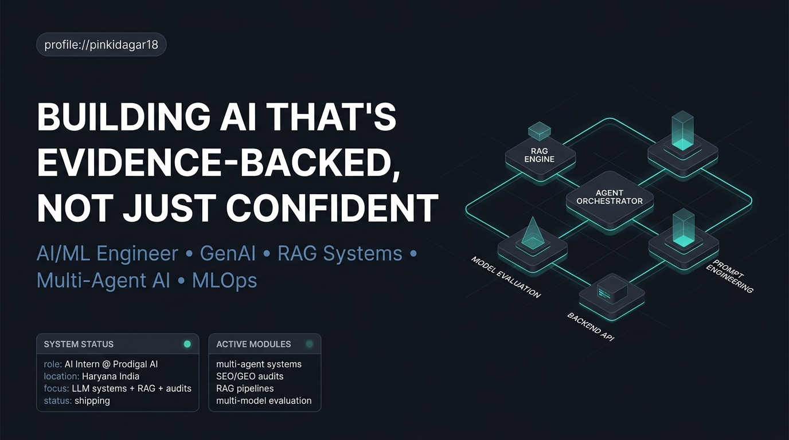
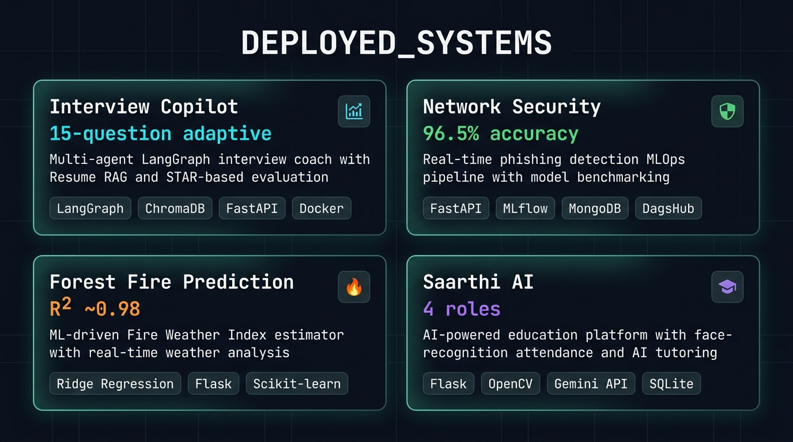
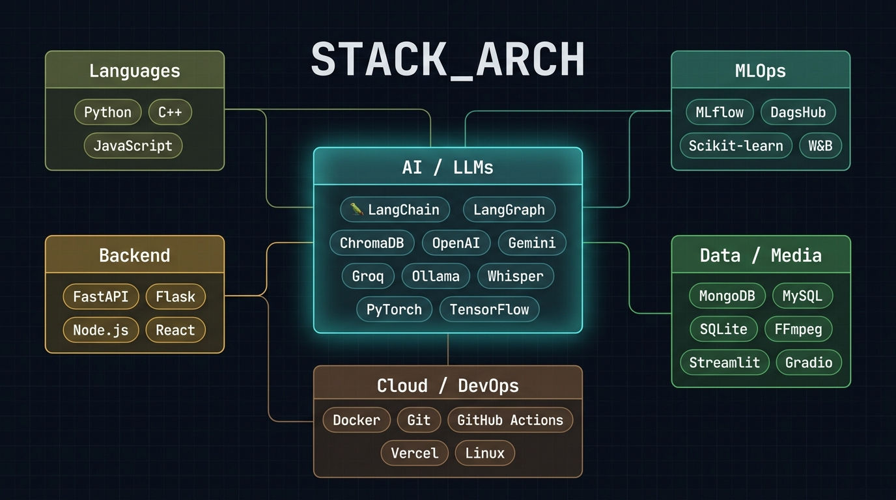

<div align="center">
  
</div>

# `PINKI-DAGAR`

```text
STATUS       : ONLINE
ROLE         : AI Intern @ Prodigal AI
LOCATION     : Palwal, Haryana, India
EDUCATION    : B.Tech CSE (AI & ML) — CGPA 8.69
OPERATING    : GenAI + RAG + Multi-Agent Systems + MLOps
PRIORITY     : Evidence-backed systems over confident demos
```

Building AI that's evidence-backed, not just confident.

I work on the layer where LLM behavior, retrieval systems, backend engineering, and evaluation discipline all collide. I don't take a single model's output at face value — I validate outputs across **ChatGPT, Gemini, Claude, and Grok** before calling something reliable. That discipline shapes how I build, not just how I audit.

## `SYSTEM_PROFILE`

- I build `LLM apps`, `RAG pipelines`, `multi-agent systems`, and `production-style AI backends`.
- I care about `evidence`, `multi-model validation`, `evaluation`, and whether a system holds up outside a notebook.
- I like turning messy requirements into clean workflows, deployed APIs, and client-ready PDF reports.

## `DEPLOYED_SYSTEMS`

<div align="center">
  
</div>

<details open>
<summary><b>&#9654; Interview Copilot — Multi-agent AI interview coach</b></summary><br>

> Built a multi-agent Generative AI interview coach using LangGraph and Groq LLM, with Resume RAG (ChromaDB + sentence-transformers), a JD Analyzer agent, and a Company Intel agent.

| Aspect | Detail |
| :-- | :-- |
| **Stack** | `Python` `FastAPI` `LangGraph` `ChromaDB` `Groq` `Docker` `Tavily` |
| **Scale** | 15-question adaptive interviews with STAR-based evaluation |
| **Impact** | Difficulty adjusts to performance; deployed on Hugging Face Spaces with Tavily web search and PDF readiness reports |
| **Links** | [](https://github.com/pinkidagar18/Interview-Copilot) [](https://pinkidagar-interviewcopilot.hf.space/) |

</details>

<details>
<summary><b>&#9654; Network Security — Real-time phishing detection MLOps pipeline</b></summary><br>

> Built a real-time end-to-end MLOps pipeline for phishing detection with FastAPI, benchmarking multiple models before selecting the best performer.

| Aspect | Detail |
| :-- | :-- |
| **Stack** | `Python` `FastAPI` `MLflow` `MongoDB` `DagsHub` `Docker` |
| **Scale** | Benchmarked Random Forest, XGBoost, Logistic Regression, Neural Networks |
| **Impact** | Random Forest selected at 96.5% accuracy; MLflow + DagsHub for experiment tracking |
| **Links** | [](https://github.com/pinkidagar18/networksecurity) [](https://pinkidagar-network-security.hf.space/) |

<p align="center">


</p>

</details>

<details>
<summary><b>&#9654; Algerian Forest Fire Prediction — Fire Weather Index estimator</b></summary><br>

> Designed an ML-driven system to analyze environmental conditions and estimate Fire Weather Index (FWI) risk in real time.

| Aspect | Detail |
| :-- | :-- |
| **Stack** | `Python` `Ridge Regression` `Flask` `Scikit-learn` |
| **Scale** | Regularized regression with standardized feature engineering |
| **Impact** | R² score of ~0.98; interactive Flask interface for live weather ingestion |
| **Links** | [](https://github.com/pinkidagar18/Algerian-Forest-Fire-Prediction-System) [](https://pinkidagar-algerian-forest-fire-prediction-system.hf.space/) |

</details>

<details>
<summary><b>&#9654; Saarthi AI — AI-powered education management system</b></summary><br>

> Developed an education management platform with face-recognition attendance, AI tutoring, and automated alerts.

| Aspect | Detail |
| :-- | :-- |
| **Stack** | `Python` `Flask` `SQLite` `Google Gemini API` `OpenCV` |
| **Scale** | Multi-role dashboards for Admin, Teacher, Student, and Parent users |
| **Impact** | OpenCV face-recognition attendance + Gemini AI tutoring + performance analytics |
| **Links** | [](https://github.com/pinkidagar18/saarthi-ai) |

</details>

## `STACK_ARCH`

<div align="center">
  
</div>

```text
Languages        : Python, C++, JavaScript
AI / LLMs        : LangChain, LangGraph, ChromaDB, OpenAI, Gemini, Groq, Ollama, Whisper, PyTorch, TensorFlow
MLOps            : MLflow, DagsHub, Scikit-learn, Jupyter
Backend          : FastAPI, Flask, Node.js, React
Cloud / DevOps   : Docker, Git, GitHub Actions, Vercel, Linux
Data / Media     : MongoDB, MySQL, SQLite, FFmpeg, Streamlit, Gradio
```

<div align="center">


<br>

<br>

<br>

<br>


<br><br>


</div>

<div align="center">


</div>

## `EXPERTISE_MAP`

| Domain | Shipped Proof |
| :-- | :-- |
| **Generative AI / RAG** | Built a multi-agent LangGraph interview coach with ChromaDB retrieval, deployed live on Hugging Face Spaces |
| **Prompt Engineering & Audits** | Designed scoring-criteria audit prompts, actively used for client SEO/GEO audits at Prodigal AI, validated across ChatGPT, Gemini, Claude, and Grok |
| **Backend & APIs** | FastAPI/Flask services powering 4 deployed projects, containerized with Docker |
| **MLOps** | Benchmarked 4 models with MLflow + DagsHub, shipped a 96.5%-accuracy phishing detector |
| **Computer Vision** | OpenCV face-recognition attendance system in a live multi-role education platform |

## `WORK_EXPERIENCE`

### AI Intern — Prodigal AI `March 2026 – Present`

- Developed Generative AI features for **Video Repurpose & Analysis Studio**, including AI-driven highlight detection, transcription, summarization, metadata extraction, and content analytics.
- Designed and refined **AI-powered SEO & GEO audit workflows**, developing structured prompts, evaluation parameters, scoring criteria, and evidence-backed recommendations.
- Conducted single and comparative audits and **validated consistency** by comparing repeated outputs across AI models including ChatGPT, Gemini, Claude, and Grok.
- Built **client-friendly PDF audit reports** with visual comparisons, citations, website evidence, and actionable optimization recommendations for non-technical users.
- Developed **Profile/Bio audit frameworks** focused on measuring impact and credibility through structured scoring, evidence-based observations, and improvement recommendations.

`LangGraph` `FastAPI` `FFmpeg` `LLMs` `Prompt Engineering` `Multi-Model Evaluation` `Docker` `ChromaDB` `RAG`

## `ACHIEVEMENTS`

| | Achievement | Detail |
| :--: | :-- | :-- |
| 🏆 | **Code Slayer 2K25** | Participant — organised by NIT Delhi |
| 🏆 | **Smart India Hackathon 2024** | Cleared the internal round |
| 📜 | **Certification** | [Complete Data Science, ML, DL, NLP Bootcamp — Udemy](https://drive.google.com/file/d/1GASs7tD7X_ZDiNjoH5dgwa426kQXR3We/view?usp=drivesdk) |
| 🎓 | **Education** | B.Tech CSE (AI & ML) — CGPA 8.69 — SVSU Palwal (Oct 2022 – July 2026) |

## `GITHUB_ANALYTICS`

<div align="center">


&nbsp;


<br>


<br><br>


</div>

## `CONTRIBUTION_SNAKE`

<div align="center">


</div>

<p align="center"><sub>Auto-generated daily by a GitHub Action — see <code>snake.yml</code> for the one-time setup.</sub></p>

## `CURRENT_FOCUS`

```text
learning     : Advanced multi-agent AI systems · Production-grade RAG architectures
building     : Video Repurpose & Analysis Studio · SEO/GEO audit workflows · Profile/Bio audit frameworks
open_to      : AI/ML Engineer roles · LLM/RAG/Agentic systems projects · GenAI research collaborations
```

## `LINK_STREAMS`

- GitHub: [@pinkidagar18](https://github.com/pinkidagar18)
- LinkedIn: [pinki-dagar](https://linkedin.com/in/pinki-dagar-481752278)
- Kaggle: [pinkidagar](https://kaggle.com/pinkidagar)
- Email: `pinkidagar18@gmail.com`
- Resume: [View Resume](https://drive.google.com/file/d/17O2wh3zVhVKuAVAZ8NDJDbcGREJ1GrXG/view?usp=sharing)

<div align="center">

[](https://linkedin.com/in/pinki-dagar-481752278)
[](https://github.com/pinkidagar18)
[](https://kaggle.com/pinkidagar)
[](https://huggingface.co/pinkidagar)
[](mailto:pinkidagar18@gmail.com)
[](https://drive.google.com/file/d/17O2wh3zVhVKuAVAZ8NDJDbcGREJ1GrXG/view?usp=sharing)

</div>

## `FINAL_NOTE`

```text
I'm not trying to ship the flashiest AI demo.
I'm trying to build systems whose outputs I can actually defend —
validated across models, backed by evidence,
useful outside a slide deck.
```

<div align="center">


&nbsp;

&nbsp;


</div>
